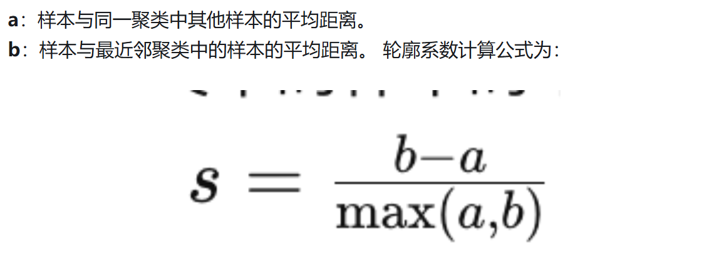

# 距离矩阵计算

## 数据展示

```{r  message=FALSE, warning=FALSE}
# 不显示message
library(cluster)
library(mlr3verse)
library(factoextra)
df = mtcars[, 3:7] # 数值型列
df = scale(df) # 数据标准化

#展示前五行
head(df, 5)

```

## 欧氏距离计算

```{r}
dist2 = dist(df, method = "euclidean")
# "euclidean", "maximum", "manhattan", "canberra", "binary" or "minkowski".分别代表 欧氏距离，切比雪夫距离，曼哈顿距离，堪培拉距离，汉明距离，闵可夫斯基距离
as.matrix(dist2)[1:3, 1:3]
```

## 曼哈顿距离

```{r}
dist_manhattan = dist(df, method = "manhattan")
as.matrix(dist_manhattan)[1:3, 1:3]
```

## 切比雪夫距离

```{r}
dist_cheby = dist(df, method = "maximum")
as.matrix(dist_cheby)[1:3, 1:3]
```

欧氏距离:适用于维度较低，关注异常值

曼哈顿距离:给予所有维度相同的权重

**切夫雪比距离：优点:** 明确定义了“最大差异”。**缺点:** 丢失了除最大差异维度外的所有信息，使用场景非常特定。

## 马氏距离计算

[马氏距离](https://zhida.zhihu.com/search?content_id=9423835&content_type=Article&match_order=1&q=%E9%A9%AC%E6%B0%8F%E8%B7%9D%E7%A6%BB&zhida_source=entity)(Mahalanobis Distance)是度量学习中一种常用的距离指标，同[欧氏距离](https://zhida.zhihu.com/search?content_id=9423835&content_type=Article&match_order=1&q=%E6%AC%A7%E6%B0%8F%E8%B7%9D%E7%A6%BB&zhida_source=entity)、[曼哈顿距离](https://zhida.zhihu.com/search?content_id=9423835&content_type=Article&match_order=1&q=%E6%9B%BC%E5%93%88%E9%A1%BF%E8%B7%9D%E7%A6%BB&zhida_source=entity)、[汉明距离](https://zhida.zhihu.com/search?content_id=9423835&content_type=Article&match_order=1&q=%E6%B1%89%E6%98%8E%E8%B7%9D%E7%A6%BB&zhida_source=entity)等一样被用作评定数据之间的相似度指标。但却可以应对高维线性分布的数据中各维度间非独立同分布的问题

```{r}
dist.maha = function(dat) {
  X = as.matrix(na.omit(dat))
  V = cov(X) # 协方差矩阵, 正定
  L = t(chol(V)) # 下三角
  stdX = t(forwardsolve(L, t(X)))  #标准化
  dist(stdX)
}

dist_m = dist.maha(mtcars[, 3:7])
as.matrix(dist_m)[1:3, 1:3]
```

## 计算相关系数距离

```{r}
dist_cor = get_dist(df, method = "pearson")
as.matrix(dist_cor)[1:3, 1:3]
```

# 距离矩阵可视化

## 热图展示距离矩阵

```{r}

fviz_dist(dist2)
```

# K-means

## K值选择方法

```{r message=FALSE, warning=FALSE}
# 确保你安装了这些包
# install.packages("tidyverse")
# install.packages("factoextra") # 我们的可视化和评估主力
# install.packages("cluster")    # 支持 gap statistic 和 silhouette
# install.packages("MASS")       # 用于生成案例2的数据

library(tidyverse)
library(factoextra) # 核心包
library(cluster)
library(MASS) # 加载 MASS 包

# 设定一个随机种子，确保你的结果可以复现
set.seed(123)

# 使用 iris 数据，移除“物种”列 (第五列)，因为 K-Means 是无监督的
data_clear <- iris %>%
  as_tibble() %>%
  dplyr::select(-Species)

# （可选）在分享时展示：数据长这样，肉眼可见三簇
ggplot(data_clear, aes(x = Petal.Length, y = Petal.Width)) +
  geom_point() +
  theme_minimal() +
  labs(title = "案例1: 清晰的聚类 (Iris 数据)")

```

### 直接使用

```{r}
# 使用肘部法则 (Elbow Method) 选择 K 值
# 1. Elbow (肘部) 法
# "wss" = "Total Within Sum of Squares"
p_elbow_1 <- fviz_nbclust(
  data_clear,
  kmeans, 
  method = "wss") +
  labs(title = "案例1 - Elbow法") +
  geom_vline(xintercept = 2, linetype = 2, color = "red") # 最佳k

# 2. Silhouette (轮廓) 法
p_sil_1 <- fviz_nbclust(
  data_clear,
  kmeans,
                        
  method = "silhouette") +
  labs(title = "案例1 - Silhouette法")
# 注意：fviz_nbclust 会自动帮你找到最大值点 (k=3)

# 3. Gap 统计量法。
# 在你的真实论文中，请使用默认值 (nboot = 500) 或更高，这会非常慢！
p_gap_1 <- fviz_nbclust(
  data_clear,
  kmeans,
  method = "gap_stat",
  nboot = 50,
  nstart = 25
) +
  labs(title = "案例1 - Gap法")

# (可选) 把图组合
gridExtra::grid.arrange(p_elbow_1, p_sil_1, p_gap_1, ncol = 1)
# 或者使用 patchwork 包`
```

### 模糊案例

```{r message=FALSE, warning=FALSE}
# 定义簇的中心和协方差矩阵
mu1 <- c(0, 0)
mu2 <- c(3, 3)
mu3 <- c(3.5, 2.5) # 注意：簇2和簇3离得非常近
sigma <- matrix(c(1, 0.5, 0.5, 1), 2)

# 生成数据
g1 <- mvrnorm(n = 100, mu = mu1, Sigma = sigma)
g2 <- mvrnorm(n = 100, mu = mu2, Sigma = sigma)
g3 <- mvrnorm(n = 100, mu = mu3, Sigma = sigma)

data_fuzzy <- bind_rows(
  as_tibble(g1, .name_repair = "minimal"),
  as_tibble(g2, .name_repair = "minimal"),
  as_tibble(g3, .name_repair = "minimal")
)
names(data_fuzzy) <- c("x", "y")

# (可选) 展示数据：簇2和簇3几乎融为一体
ggplot(data_fuzzy, aes(x, y)) +
  geom_point() +
  theme_minimal() +
  labs(title = "案例2: 模糊/重叠的聚类")

# 1. Elbow 法
p_elbow_2 <- fviz_nbclust(data_fuzzy, kmeans, method = "wss") +
  labs(title = "案例2 - Elbow法")

p_elbow_2


# 2. Silhouette 法
p_sil_2 <- fviz_nbclust(data_fuzzy, kmeans, method = "silhouette") +
  labs(title = "案例2 - Silhouette法")

p_sil_2
# 峰值在 k=2 还是 k=3？

# 3. Gap 统计量法
p_gap_2 <- fviz_nbclust(
  data_fuzzy,
  kmeans,
  method = "gap_stat",
  nboot = 50,
  nstart = 25
) +
  labs(title = "案例2 - Gap法")
p_gap_2

```



### 随机数据

```{r}

# 生成均匀分布的随机数据
data_random <- tibble(
  x = runif(300, min = 0, max = 10),
  y = runif(300, min = 0, max = 10)
)

# (可选) 展示数据：完全没有结构
ggplot(data_random, aes(x, y)) +
  geom_point() +
  theme_minimal() +
  labs(title = "案例3: 无结构 (随机噪音)")
# 1. Elbow 法
p_elbow_3 <- fviz_nbclust(data_random, kmeans, method = "wss") +
  labs(title = "案例3 - Elbow法")
p_elbow_3
# 陷阱！新手可能还是会找一个“肘点”

# 2. Silhouette 法
p_sil_3 <- fviz_nbclust(data_random, kmeans, method = "silhouette") +
  labs(title = "案例3 - Silhouette法")
p_sil_3
# 注意看 Y 轴，所有的值都非常低！

# 3. Gap 统计量法
p_gap_3 <- fviz_nbclust(
  data_random,
  kmeans,
  method = "gap_stat",
  nboot = 50,
  nstart = 25
) +
  labs(title = "案例3 - Gap法")
p_gap_3
# 真正的答案：k=1 是最优的
```

## kmeans实战

### 创建数据

```{r}
library(tidyverse)
library(factoextra)
# install.packages("tidyverse") # 如果你没有安装
library(tidyverse)

#使用鸢尾花数据,Sepal.Length花萼长度,petal_length花冠长度
data("iris")

data <- iris[1:100,] %>%
  dplyr::select(-Species) 


head(data)

```

### 选择k值

```{r}
p1 <- fviz_nbclust(data, kmeans, method = "wss") +
  labs(subtitle = "Elbow 法")

p2 <- fviz_nbclust(data, kmeans, method = "silhouette") +
  labs(subtitle = "Silhouette 法")

p3 <- fviz_nbclust(data,
  kmeans,
  method = "gap_stat",
  nboot = 50,
  nstart = 25 )+
  labs(subtitle = "gap 法")


gridExtra::grid.arrange(p1, p2,p3,  ncol = 1)

```

### 创建聚类任务

```{r warning=FALSE}
#https://mlr3book.mlr-org.com/
library(mlr3verse)

mlr_tasks
# 生成tsk
task <- as_task_clust(data)

##选择 clust.kmeans 学习器，设置聚类数为 3, 训练模型：
learner = lrn("clust.kmeans", centers = 2, nstart = 25)

learner$train(task)

km = learner$model

broom::glance(km)


```

|  |  |  |
|------------------------|------------------------|------------------------|
| 参数 (Column) | 含义 | 解释 (它在衡量什么？) |
| **`totss`** | **总离差平方和** (Total Sum of Squares) | **这是一个基准值。** 它衡量的是你**原始数据**到底有多分散。它计算的是**每一个点**到**整个数据集中心点**（注意：不是簇中心）的距离平方之和。这个值对你的数据集是固定的，与 K 等于几无关。 |
| **`tot.withinss`** | **簇内总离差平方和** (Total Within-cluster SS) | **这就是肘部法(Elbow)的 WSS！** 这是**最核心的紧凑度指标**。它计算每个点到**各自所属簇中心**的距离平方和，然后把所有簇的这个值加起来。**这个值越小，说明簇内越紧凑，聚类效果越好。** |
| **`betweenss`** | **簇间离差平方和** (Between-cluster SS) | **这是核心的分离度指标。** 它衡量的是**各个簇的中心点**之间有多分散（具体说是各个簇中心到数据集总中心的加权距离平方和）。**这个值越大，说明簇与簇之间分离得越远，聚类效果越好。** |
| **`iter`** | **迭代次数** (Iterations) | K-Means 算法在内部“移动”了多少次中心点才最终“稳定” (收敛)。这通常用于诊断，如果这个数字达到了你设置的上限（比如 100），可能说明算法没有收敛 |

### 查看各个样本归入的类别

```{r warning=FALSE}
km_res = bind_cols(data, Class = km$cluster)
head(km_res)
# 聚类中心
km_res[, -1] %>%
  group_by(Class) %>%
  summarise(n = n(), across(.fns = mean)) %>%
  mutate(withins = km$withinss)


```

## 层次聚类

### 数据准备

```{r}
library(tidyverse)
data(GvHD, package = "mclust")
gvhdTib <- as_tibble(GvHD.control)[1:1000, ]
#对GvHD数据集进行尺度缩放
gvhdScaled <- gvhdTib %>% scale()
head(gvhdScaled)
```

### 创建任务

```{r}
task <- as_task_clust(as.data.frame(gvhdScaled))
autoplot(task)

```

### 设置算法

```{r}
lrn()

learner_Hclust <- lrn("clust.hclust", 
                      method = "ward.D2") #聚合聚类算法

learner_Diana <- lrn("clust.diana") #分裂聚类算法

```

### 训练模型

```{r}
#聚合聚类算法
learner_Hclust$train(task)

autoplot(learner_Hclust) + theme(axis.title.y = element_text(size = 0.1))
#分裂算法

learner_Diana$train(task)

autoplot(learner_Diana) + theme(axis.title.y = element_text(size = 0.1))
```

层次聚类与K-均值算法不同，层次聚类无法预测新样本的聚类，因此无法执行类似交叉验证过程来估计不同数目聚类的性能。那我们可以使用rsmp("insample")，模型会在每个训练集样本上进行训练，并在相同的样本上进行测试。

### 评估聚类数目

```{r warning=FALSE}

#重新构建学习器
learner_Hclust <- lrn("clust.hclust", method = "ward.D2", k = to_tune(2, 8)) 

#聚合算法
future::plan("multisession")
instance_Hclust <- tune(
  tuner = tnr("grid_search"),
  task = task,
  learner = learner_Hclust,
  resampling = rsmp("insample"),
  measures = msrs(c("clust.ch", "clust.dunn", "clust.silhouette", "clust.wss")),
  terminator = trm("none")
)

as.data.table(instance_Hclust$result)[, c(-2, -3)]
print(instance_Hclust$result)

#根据性能指标，聚类数量选择4或者5比较好。通常，将无监督任务简化为定量度量可能没有用（如果没有基础事实），相反，可视化可能是评估聚类质量的更有效工具。

res_df <- as.data.frame(instance_Hclust$result)
# 打印列名以便调试（可选）
print(names(res_df))

# 如果列名为 clust.wss, clust.silhouette, clust.ch（由 measures 指定），则绘图：
p1 <- ggplot(res_df, aes(x = k, y = clust.wss)) +
  geom_line() + geom_point() +
  labs(title = "Elbow 法", x = "k", y = "WSS")

p2 <- ggplot(res_df, aes(x = k, y = clust.silhouette)) +
  geom_line() + geom_point() +
  labs(title = "Silhouette 法", x = "k", y = "Silhouette")

#p3 <- ggplot(res_df, aes(x = k, y = clust.ch)) +
 ##labs(title = "Gap 统计量法 (使用 clust.ch 作为近似)", x = "k", y = "CH 指标")
# 合并图
gridExtra::grid.arrange(p1, p2, nr = 1)


```

### 设定k后运行

```{r warning=FALSE}

learner_Hclust_4 <- lrn("clust.hclust", method = "ward.D2", k = 4)
learner_Hclust_5 <- lrn("clust.hclust", method = "ward.D2", k = 5)

prediction_4 <- learner_Hclust_4$train(task)$predict(task)
prediction_5 <- learner_Hclust_5$train(task)$predict(task)

```

### 可视化结果

```{r}
autoplot(prediction_4, task, type = "pca")
autoplot(prediction_5, task, type = "pca")
```

利用PCA降维后数据重叠较为严重，我们试试使用UMAP降维，再把聚类类别映射到数据集上

问题的根源：为什么PCA会导致“重叠”？ **PCA是线性的：** PCA的核心是寻找数据中**方差最大**的方向（主成分）。它本质上是在高维空间中找到一个“平坦”的低维超平面来进行“投影”。 **“压扁”非线性结构：** 想象一下，你的数据簇在高维空间中可能像一个“瑞士卷”或者两个“相互缠绕的弹簧”。当PCA试图用一个平面（像一张纸）去“压扁”这个立体的瑞士卷时，不同层次的“卷”就会重叠在一起。 **医学上的例子：** 比如，你有一群病人，他们可能根据病程（早期、中期、晚期）和两种不同的治疗反应（A型、B型）分成了不同的亚群。这些亚群在高维的生物标志物空间中可能是“弯曲”或“嵌套”的。PCA这个“线性”的工具无法“解开”这种复杂的结构，导致它们在2D图上重叠。 2. 解决方案：UMAP（一种非线性流形学习）

UMAP (Uniform Manifold Approximation and Projection) 是一种强大且现代的**非线性**降维技术。 **UMAP的目标：** 它的目标与PCA完全不同。它不关心方差，而是试图在低维空间中**保持高维数据的“拓扑结构”**。 **通俗的解释：** UMAP会首先在高维空间中找到每个数据点的“邻居”，构建一个复杂的“邻居关系网络”。然后，它在低维空间（例如2D）中“绘制”一张新地图，并尝试**最大程度地保留这个“邻居关系”**。 **为什么它能解决“重叠”：** 它会像“解开”那个瑞士卷一样，把高维空间中“邻近但不同”的簇，在2D平面上**拉开**，同时保持簇内部的紧凑性。它非常擅长识别并分离那些PCA无法区分的复杂集群。

```{r warning=FALSE}
library(umap)
gvhd_umap <- umap(
  gvhdScaled,
  n_neighbors = 20,
  min_dist = 0.6,
  n_epochs = 500,
  verbose = TRUE
)

data <- data.frame(
  UMAP1 = gvhd_umap$layout[, 1],
  UMAP2 = gvhd_umap$layout[, 2],
  group_4 = factor(as.data.table(prediction_4)[[2]]),
  group_5 = factor(as.data.table(prediction_5)[[2]])
)
library(ggsci)
ggplot(data, aes(x = UMAP1, y = UMAP2, col = group_4)) +
  geom_point() +
  scale_color_aaas()

ggplot(data, aes(x = UMAP1, y = UMAP2, col = group_5)) +
  geom_point() +
  scale_color_aaas()
```

### `轮廓图`

`Silhouette plots 是一种用于评估聚类质量的可视化工具。在 Silhouette plots 中，每个数据点都被分配一个 Silhouette 系数，该系数表示该数据点与其所属簇内其他数据点的相似度和该数据点与最近的其他簇的数据点的不相似度之间的比率。Silhouette plots 提供了一种直观的方式来解读聚类分析的结果，帮助我们评估聚类的效果并做出相关的调整和改进。 Silhouette 系数的取值范围在 -1 到 1 之间，其中： 1 表示数据点与其所属簇内的其他数据点非常相似，并且与其他簇的数据点非常不相似； 0 表示数据点与其所属簇内的其他数据点相似度相当于与其他簇的数据点相似度； -1 表示数据点更类似于其他簇的数据点而不是其所属簇的数据点。`

> `在 Silhouette plots 中，通常会显示每个数据点的 Silhouette 系数，并且会将数据点按照其所属簇进行排序。通过观察 Silhouette plots，可以帮助我们判断聚类的合理性和质量，以及确定最佳的簇数量。 从Silhouette plots图来看，在聚类类别3中有部分样本与这个类别差异较大；如果把类别3继续细分成两个类别，Silhouette会有一定的改善，但是改善不是很大。 如果给定聚类的平均轮廓值低于平均轮廓系数线（虚线），则这意味着该聚类没有被很好地定义。所以类别3没有很好的被定义。`

```{r}
autoplot(prediction_4, task, type = "sil")
autoplot(prediction_5, task, type = "sil")

```

### 重新绘制树状图

```{r warning=FALSE}
library(colorhcplot)
model <- learner_Hclust_4$model
gvhdcut <- cutree(model, k = 4)
gvhdTib$clusters <- gvhdcut
da <- gvhdTib %>%
  group_by(clusters) %>%
  summarize_all(mean) %>%
  round(3)

c1 <- factor(gvhdcut, levels = c(1:4), labels = paste("cluster", 1:4))
colorhcplot(model, c1)
```

Jaccard指数是一种用于衡量两个集合之间相似性的统计指标。它定义为两个集合交集的大小与它们并集大小的比值。Jaccard指数的取值范围在0到1之间，值越接近1表示两个集合的相似度越高，而值越接近0表示两个集合的相似度越低。

```{r warning=FALSE, message=FALSE}
library(fpc)

#10个图合一起
par(mfrow = c(3, 4))

clustBoot <- clusterboot(
  dist(gvhdScaled, method = "euclidean"),
  B = 10,
  clustermethod = disthclustCBI,
  k = 4,
  cut = "number",
  method = "ward.D2",
  showplots = TRUE
)

clustBoot
clustBoot$bootmean

```

所有4个聚类在不同的自助采样样本中具有良好的一致性（\>73%），其中三个类别一致性＞88%，这表明聚类具有很高的稳定性
